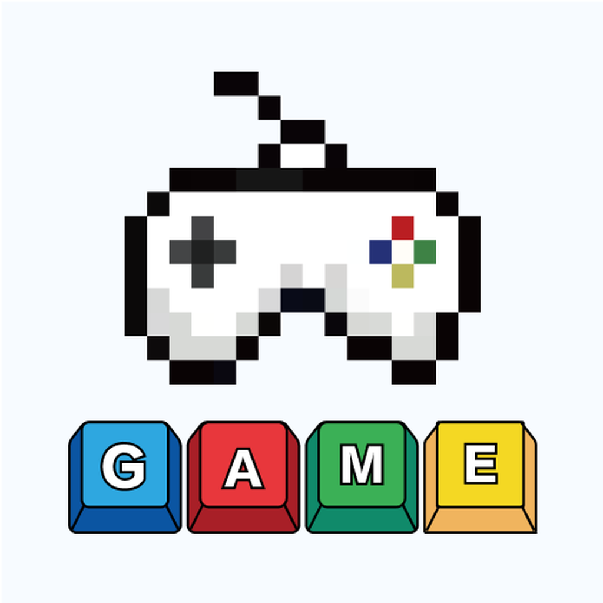
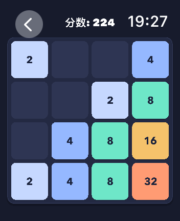
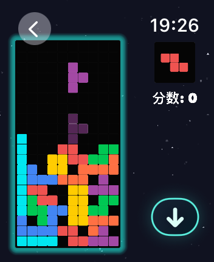
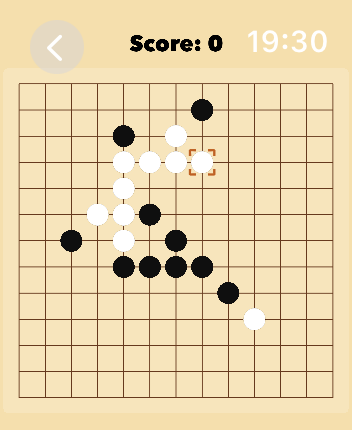
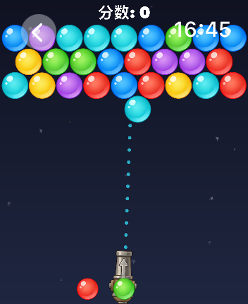
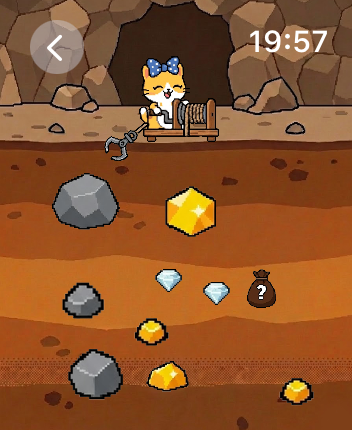
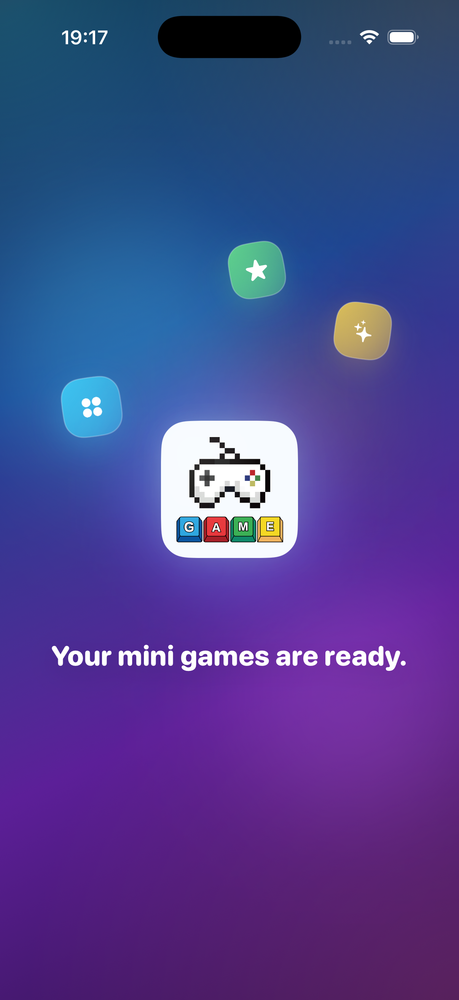
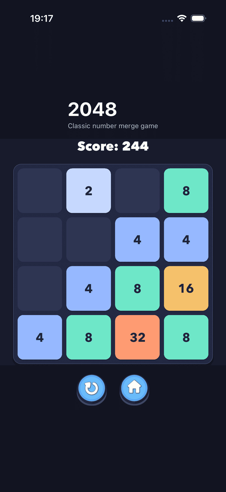

# Games for Watch — Classic Mini Games on Apple Watch & iPhone

> A collection of classic mini-games designed for **Apple Watch first**, with full iPhone support. No ads, no in-app purchases, just pure gaming fun.

## Screenshots

### Apple Watch
|  |  |  |
|:--:|:--:|:--:|
|  |  |  |
|  |  |  |

### iPhone
|  |  |
|:--:|:--:|
|  |  |
|  | 

## Features

- ⌚ **Apple Watch First** — Play directly on your wrist during commutes, waiting in line, or whenever you have a spare moment
- 📱 **iPhone Compatible** — Full iOS support with optimized touch controls
- 🎮 **20+ Classic Games** — Tetris, 2048, Gomoku, Sokoban, Brick Breaker, Bubble Shooter, Gold Miner, Merge Tomato, Knife Challenge, Soccer Star, Racing, and more
- 🚫 **No Ads, No IAP** — One-time purchase, no distractions, no microtransactions
- 🎨 **Native Watch Experience** — Designed specifically for the small screen with intuitive Digital Crown and tap interactions
- 🏆 **Game Center Leaderboards** — Compete with friends and track your high scores across devices

## Games Included

### Watch OS Optimized
| Game | Type |
|------|------|
| 2048 | Puzzle |
| Tetris | Arcade |
| Gomoku (Five in a Row) | Strategy |
| Bubble Shooter | Arcade |
| Gold Miner | Arcade |
| Brick Breaker | Arcade |
| Merge Tomato | Puzzle |
| Knife Challenge | Casual |
| Soccer Star | Sports |
| Racing (City Racer) | Racing |

### iPhone Enhanced
| Game | Type |
|------|------|
| 2048 | Puzzle |
| Tetris | Arcade |
| Gold Miner | Arcade |
| Merge Tomato | Puzzle |
| Sokoban | Puzzle |
| Rankings / Leaderboards | Social |

## Tech Stack (Landing Page)

This repo is the official landing page for the app:

- [Astro](https://astro.build/) — Static site generation
- [Tailwind CSS](https://tailwindcss.com/) — Utility-first styling
- Dark mode & responsive design
- SEO & Open Graph optimized

## Commands

| Command                | Action                                            |
| :--------------------- | :------------------------------------------------ |
| `npm install`          | Install dependencies                              |
| `npm run dev`          | Start local dev server at `localhost:4321`        |
| `npm run build`        | Build your production site to `./dist/`           |
| `npm run preview`      | Preview your build locally, before deploying      |
| `npm run format`       | Format code with Prettier                         |
| `npm run clean`        | Remove `node_modules` and build output            |

## Download

📲 **[Get it on the App Store](https://geo.itunes.apple.com/app/id6752821820)**

Compatible with Apple Watch Series 3 and later, running watchOS 9+. Requires iOS 14.0 or later.

---

© 2025 Games for Watch. All rights reserved.
